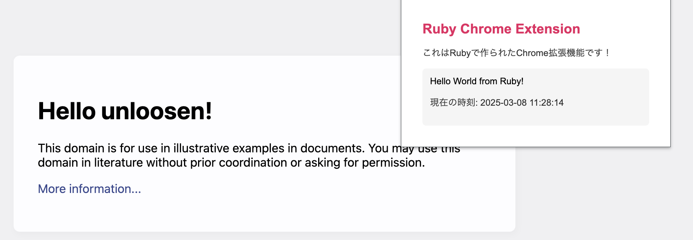

# Ruby Chrome Extension Hello World

Unloosenフレームワークを使用しています。

## セットアップ方法

1. 依存関係をインストールします：
```
> bundle install
```

2. Chromeで拡張機能をロードします：
   - Chromeで `chrome://extensions` を開きます
   - 「デベロッパーモード」を有効にします
   - 「パッケージ化されていない拡張機能を読み込む」をクリックします
   - `dist` ディレクトリを選択します

3. 拡張機能のアイコンをクリックすると、ポップアップが表示されます。

## スクリーンショット

以下は拡張機能のスクリーンショットです：


